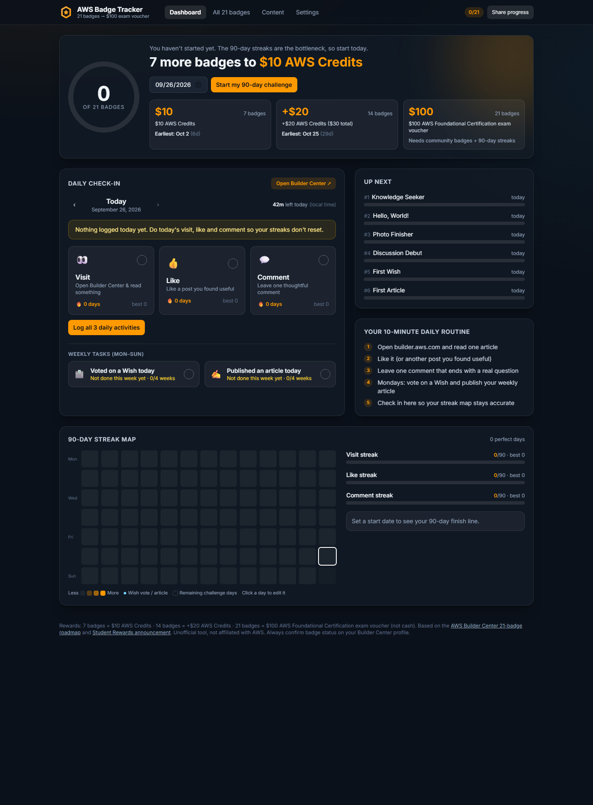

# AWS Badge Tracker

**Live app: [aws-badge-tracker.vercel.app](https://aws-badge-tracker.vercel.app)**

Track all **21 AWS Builder Center badges** and see exactly when you unlock each Student Rewards milestone:

| Badges | Reward |
| --- | --- |
| 7 | $10 AWS Credits |
| 14 | +$20 AWS Credits ($30 total) |
| 21 | **$100 exam voucher** for AWS Certified Cloud Practitioner or AI Practitioner |

The voucher is not cash. The code is issued within 8 business days of claiming it and is valid for 6 months from the claim date.



## Why

Several badges need unbroken 7, 30 and 90-day streaks, 4 consecutive weeks of activity, or engagement from other people.
Missing a single day resets a streak, so the fastest path is to start every streak on day 1 and never break it. This app
makes that routine visible and hard to forget.

## Features

- **Daily check-in**: log visit / like / comment in one tap, with a live "time left today" countdown and a warning when a streak is at risk.
- **Automatic streaks**: current and best streak per activity, computed from your check-ins. The 7/30/90-day badges unlock by themselves.
- **Weekly tasks**: Wish votes and article publishing tracked per ISO week (Mon–Sun) for the 4-week badges.
- **All 21 badges** grouped into the 6 roadmap phases, each with its requirement, progress bar, earliest-possible date and a practical tip.
- **Milestone projections**: the earliest date you can reach $10, $30 and the $100 voucher if you don't miss a day.
- **90-day streak map**: heatmap of your challenge with the finish-line date. Click any day to backfill it.
- **Community badge counters**: replies, Wish votes, and comments/articles with 10+ likes.
- **Content planner**: plan weekly articles, mark them published (logs the weekly task) and track likes toward Valued Creator.
- **Comment prompts & Wish ideas** you can copy with one click, written to start conversations.
- **Calendar reminders**: download an `.ics` with a daily and a weekly reminder for Google/Outlook/Apple Calendar.
- **Private by design**: data lives in your browser's `localStorage`. Export/import a JSON backup to move devices.
- **Share progress**: copy a ready-made summary for LinkedIn or X.

## The 21 badges

| Phase | Badges |
| --- | --- |
| 1. Quick wins | Knowledge Seeker (read 10 articles), Hello, World! (About section), Photo Finisher, Discussion Debut, First Wish, First Article |
| 2. 7-day streaks | Visit (signed in), Like, Comment |
| 3. 4-week streaks | Wish Vote Streak, Article Publishing Streak |
| 4. 30-day streaks | Visit, Like, Comment |
| 5. Community | Conversation Starter (10 comments with replies), Idea Influencer (10 Wish votes), Meaningful Contributor (5 comments × 10 likes), Valued Creator (5 articles × 10 likes) |
| 6. 90-day streaks | Visit, Like, Comment |

Sources: [The complete roadmap to all 21 AWS Builder Center badges](https://builder.aws.com/content/3JJRhS6Hfh0Sf2ssvZLpQKai0xY/the-complete-roadmap-to-all-21-aws-builder-center-badges) , [A complete breakdown of all 21 badges](https://builder.aws.com/content/3IXWU6hpqCLsaXPfPr97QndERO0/a-complete-breakdown-of-all-21-aws-builder-center-badges), the [AWS Student Rewards announcement](https://builder.aws.com/content/3I1qkUtKhwU6K1VaGkfYRwtbz3o) and the [Builder Center FAQ](https://builder.aws.com/faq).

## Tech stack

React 19 + TypeScript + Vite + Tailwind CSS v4. No backend; it deploys as a static site on Vercel.

## Run locally

```bash
npm install
npm run dev
```

Build for production with `npm run build` (output in `dist/`).

## Deploy

Import the repo on [Vercel](https://vercel.com/new). The Vite preset is detected automatically (build command `npm run build`, output `dist`).

---

Unofficial tool, not affiliated with Amazon Web Services. Always confirm badge status on your Builder Center profile.
