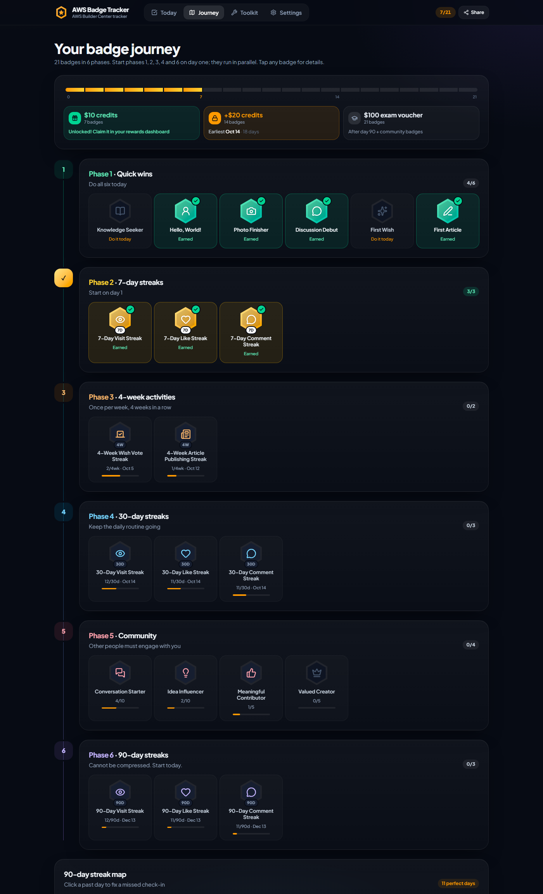

# AWS Badge Tracker

**Live app: [aws-badge-tracker.vercel.app](https://aws-badge-tracker.vercel.app)**

Track all **21 AWS Builder Center badges** and see exactly when you unlock each Student Rewards milestone:

| Badges | Reward |
| --- | --- |
| 7 | $10 AWS Credits |
| 14 | +$20 AWS Credits ($30 total) |
| 21 | **$100 exam voucher** for AWS Certified Cloud Practitioner or AI Practitioner |

The voucher is not cash. The code is issued within 8 business days of claiming it and is valid for 6 months from the claim date.


## Why

Several badges need unbroken 7, 30 and 90-day streaks, 4 consecutive weeks of activity, or engagement from other people.
Missing a single day resets a streak, so the fastest path is to start every streak on day 1 and never break it. This app
turns that into a short daily checklist and always tells you what to do next.

## How it works

1. **Set up in a minute**: first launch asks which badges you already have and your current streaks, so the tracker matches your Builder Center profile.
2. **Today**: a prioritized mission list (daily streaks first, then quick wins, then weekly tasks). The next step is highlighted, and every mission shows which badges it counts toward.
3. **Journey**: a map of all 21 badges across the 6 phases with progress, earliest-possible dates and details for each badge.
4. **Toolkit**: an article planner, comment prompts that get replies, and Wish ideas.



## Features

- **Today's missions** with a "time left today" countdown and a warning when streaks are at risk.
- **Automatic streaks**: ticking a mission updates every 7/30/90-day and 4-week badge it feeds. Badges unlock with confetti.
- **Reward track**: progress to $10, +$20 and the $100 voucher, with the earliest date you can reach each one.
- **Badge details**: tap any badge for its requirement, progress, ETA, a tip, and "I already have this" to match your profile.
- **90-day streak map**: tap a past day to fix a missed check-in.
- **Community counters** for replies, Wish votes, and comments/articles with 10+ likes.
- **Toolkit**: article planner (publishing logs the weekly mission, likes count toward Valued Creator), copyable comment prompts and Wish ideas.
- **Calendar reminders** (`.ics`), JSON backup/restore, and a UTC or local day boundary.
- **Private**: data stays in your browser's `localStorage`. No account, no server.
- **Mobile-first**: bottom tab bar, bottom-sheet dialogs, linkable tabs (`#journey`, `#toolkit`, `#settings`).

## The 21 badges

| Phase | Badges |
| --- | --- |
| 1. Quick wins | Knowledge Seeker (read 10 articles), Hello, World! (About section), Photo Finisher, Discussion Debut, First Wish, First Article |
| 2. 7-day streaks | Visit (signed in), Like, Comment |
| 3. 4-week streaks | Wish Vote Streak, Article Publishing Streak |
| 4. 30-day streaks | Visit, Like, Comment |
| 5. Community | Conversation Starter (10 comments with replies), Idea Influencer (10 Wish votes), Meaningful Contributor (5 comments × 10 likes), Valued Creator (5 articles × 10 likes) |
| 6. 90-day streaks | Visit, Like, Comment |

Sources: [The complete roadmap to all 21 AWS Builder Center badges](https://builder.aws.com/content/3JJRhS6Hfh0Sf2ssvZLpQKai0xY/the-complete-roadmap-to-all-21-aws-builder-center-badges), [A complete breakdown of all 21 badges](https://builder.aws.com/content/3IXWU6hpqCLsaXPfPr97QndERO0/a-complete-breakdown-of-all-21-aws-builder-center-badges), the [AWS Student Rewards announcement](https://builder.aws.com/content/3I1qkUtKhwU6K1VaGkfYRwtbz3o) and the [Builder Center FAQ](https://builder.aws.com/faq).

## Tech stack

React 19 + TypeScript + Vite + Tailwind CSS v4 + lucide icons. No backend; it deploys as a static site on Vercel.

## Run locally

```bash
npm install
npm run dev
```

Build for production with `npm run build` (output in `dist/`).

## Deploy

Import the repo on [Vercel](https://vercel.com/new). The Vite preset is detected automatically (build command `npm run build`, output `dist`).

---

Unofficial tool, not affiliated with Amazon Web Services. Always confirm badge status on your Builder Center profile.
